# DS605 Group Project

## Team Members

1. 202518001 Kunal Pramanik (Building Models)
2. 202518004 Aman Chauhan (EDA)
3. 202518008 Devam Gandhi (Building Models)
4. 202518036 Kashyap Patel (Data Scraping)
5. 202518051 Raj Nakrani (Preprocessing)

## Problem Statement and Objective

### Problem Statement

Online product listings contain a wide range of attributes such as price, category hierarchy, rating, and textual descriptions. However, the discount rate applied to products often varies significantly across categories, brands, and pricing segments. Identifying patterns in these attributes and predicting the discount rate is a challenging task due to high variability, noisy textual information, and the scale of data. This project aims to model the underlying factors influencing discounts and accurately estimate the discount rate for any given product.

### Objective

The primary objective is to develop a predictive model that can estimate the discount rate of a product using its price, hierarchy information, ratings, and textual metadata.

## Data Scraping

**Data Source:** flipkart.com

### Key Insights from the Flipkart robots.txt Configuration

```
User-agent: Mediapartners-Google
Disallow:

User-agent: Adsbot-Google
Disallow:

User-agent: Googlebot-Image
Disallow:

# cart
User-agent: *
Disallow: /viewcart

# Something related to carousel and recommendation carousel
User-agent: *
Disallow: /dynamic/

# Permanent Link For Individual Review
User-agent: *
Disallow: /reviews/

# Old Browse Page Experience
User-agent: *
Disallow: /store/

# Affiliate Widget
User-agent: *
Disallow: /affiliateWidget/

# Social Connect Redirects
User-agent: *
Disallow: /sc/

# Product Seller Pages
User-agent: *
Disallow: /ps/

# Temporary Hack
User-agent: *
Disallow: /ph/search/

#Alliances Pages
User-agent: *
Disallow: /alliances/

# URL parameters blocking for SEO
User-agent: *
Disallow: /*?colorSelected=
Disallow: /*?layout=
Disallow: /*?primarySection=
Disallow: /*?sizeSelected=
Disallow: /*&colorSelected=
Disallow: /*&layout=
Disallow: /*&primarySection=
Disallow: /*&sizeSelected=
Disallow: *=facets*
Disallow: *sort=*
Disallow: */~cs-*
Disallow: */1/easysize*
Disallow: */3/product/*
Disallow: */answers/*
Disallow: */immerse?*
Disallow: */item/product-delivery*
Disallow: */item/product-warranty*
Disallow: */item/seller-callout/itemId?*
Disallow: */login?*
Disallow: */offer-details*
Disallow: */payments-callout/*
Disallow: */pbo-offer*
Disallow: */pp-protect-promise-fee?*
Disallow: */pp/*
Disallow: */product-emi-details?*
Disallow: */product-questions*
Disallow: */products-list/bought-together?*
Disallow: */products-list/recommended-for-you?*
Disallow: */quick-view?*
Disallow: */review-image-fullscreen?*
Disallow: */review-image-grid?*
Disallow: */review-video-fullscreen*
Disallow: */review-video-grid*
Disallow: */review-media-grid*
Disallow: */rpd-product-details?*
Disallow: */rv/sizechart?*
Disallow: */seller-details?*
Disallow: */sellers?*
Disallow: */sellers/*
Disallow: */specifications?*
Disallow: */swatch/*
Disallow: */threed-main-compare-view?*
Disallow: */user-address*
Disallow: */video-player?*
Disallow: */write-question/*
Disallow: */write-review/*
Disallow: */searchsuggestion*
Disallow: /search?
Disallow: /search-book?
Disallow: /search.php?
Disallow: *page=*
Disallow: *search.flipkart.com*
Disallow: */ratings-reviews-details-page
Disallow: */affiliate/displayWidget

# AMP Pages
User-agent: *
Disallow: /amp/

# Post Order Pages
User-agent: *
Disallow: /rv/orders/share

Sitemap: https://www.flipkart.com/sitemap_v_view-browse.xml.gz
Sitemap: https://www.flipkart.com/sitemap_p_product_index_1.xml
Sitemap: https://www.flipkart.com/sitemap_p_product_index_2.xml
Sitemap: https://www.flipkart.com/sitemap_p_product_index_3.xml
Sitemap: https://www.flipkart.com/sitemap_p_product_index_4.xml
Sitemap: https://www.flipkart.com/sitemap_p_product_index_5.xml
Sitemap: https://www.flipkart.com/sitemap_p_product_index_6.xml
Sitemap: https://www.flipkart.com/sitemap_p_product_index_7.xml
Sitemap: https://www.flipkart.com/sitemap_p_product_index_8.xml
Sitemap: https://www.flipkart.com/sitemap_p_product_index_9.xml
Sitemap: https://www.flipkart.com/sitemap_p_product_index_10.xml
Sitemap: https://www.flipkart.com/sitemap_p_product_index_11.xml
Sitemap: https://www.flipkart.com/sitemap_p_product_index_12.xml
Sitemap: https://www.flipkart.com/sitemap_p_product_index_13.xml
Sitemap: https://www.flipkart.com/sitemap_p_product_index_14.xml
Sitemap: https://www.flipkart.com/sitemap_p_product_index_15.xml
Sitemap: https://www.flipkart.com/sitemap_p_product_index_16.xml
Sitemap: https://www.flipkart.com/sitemap_p_product_index_17.xml
Sitemap: https://www.flipkart.com/sitemap_p_product_index_18.xml
Sitemap: https://www.flipkart.com/sitemap_p_product_index_19.xml
Sitemap: https://www.flipkart.com/sitemap_p_product_index_20.xml
Sitemap: https://www.flipkart.com/sitemap_p_product_index_21.xml
Sitemap: https://www.flipkart.com/sitemap_p_product_index_22.xml
Sitemap: https://www.flipkart.com/sitemap_p_product_index_23.xml
Sitemap: https://www.flipkart.com/sitemap_p_product_index_24.xml
Sitemap: https://www.flipkart.com/sitemap_p_product_index_25.xml
Sitemap: https://www.flipkart.com/sitemap_p_product_index_26.xml
Sitemap: https://www.flipkart.com/sitemap_p_product_index_27.xml
Sitemap: https://www.flipkart.com/sitemap_p_product_index_28.xml
Sitemap: https://www.flipkart.com/sitemap_p_product_index_29.xml
Sitemap: https://www.flipkart.com/sitemap_p_product_index_30.xml
Sitemap: https://www.flipkart.com/sitemap_p_product_index_31.xml
Sitemap: https://www.flipkart.com/sitemap_p_product_index_32.xml
```

**Insights:**

1. The site permits major Google bots but restricts general crawlers from accessing dynamic, personalized, or user-specific sections such as cart, recommendations, reviews, seller pages, and user-address pages.
2. A large set of URL parameters (sorting, filtering, color, size, facets, layout) is blocked to prevent indexing duplicate or parameterized versions of the same product pages.
3. Search-related URLs and AMP pages are disallowed, indicating the platform wants only canonical, meaningful pages indexed.
4. Deprecated or internal sections like `/store/`, `/affiliateWidget/`, and several widget-based or interactive endpoints are excluded from crawling to maintain SEO hygiene.
5. The robots.txt lists 32 product sitemaps, showing the platform supports structured indexing of a very large product catalog.
6. Overall, the file aims to maximize crawl efficiency by exposing clean product URLs through sitemaps while preventing indexing of redundant, dynamic, or sensitive endpoints.

### Scraping Procedure

The scraping workflow began by extracting all product URLs from the platform’s sitemap, which was divided across 32 sitemap files. From each file, a uniform random sample of 20,000 URLs was selected to ensure broad and unbiased coverage of product categories. Each sampled URL was then visited individually, and the corresponding product page was parsed to collect all required fields, including textual attributes, pricing details, discount information, and category hierarchy. This structured approach ensured efficient crawling, controlled data volume, and reliable extraction of high-quality product information.

## Preprocessing

### Phase 1 (PRE-EDA)

In the first phase, two raw data files were merged into a single consolidated dataset. Irrelevant columns such as rating_counts, review_counts, and discounted_price were removed. Data types were corrected, and rows with missing values in critical fields—such as price, discount, or title—were dropped. Missing descriptions were filled with “No Description”, and missing category hierarchies were marked as “Unknown”.

A hierarchy list was generated from the extracted category path, along with a computed hierarchy depth. Individual hierarchy levels were then created for easier downstream analysis. Emoji characters were removed from both titles and descriptions to ensure text cleanliness.

The final cleaned dataset from this phase was saved and used as the input for EDA.

### Phase 2 (POST-EDA)

In the second phase, additional refinement steps were applied to the EDA-ready dataset. Unnamed index-like columns were dropped, and the extremely large Mobiles & Accessories category was downsampled to balance the dataset. Several unnecessary category-level columns and other redundant fields were removed to streamline the structure.

The resulting dataset was exported as a clean, modeling-ready file for machine learning experiments.

## Exploratory Data Analysis

**5 Number Summary of Numeric Features:**

|       Stat       |    price     |  discount   | rating_value | hierarchy_depth |
|------------------|--------------|-------------|--------------|-----------------|
| **count**        | 508525.000000 | 508525.000000 | 474497.000000 | 508525.000000 |
| **mean**         | 1261.916574  | 63.958069   | 3.736589     | 6.557750        |
| **std**          | 2762.484545  | 16.339667   | 0.459571     | 0.804129        |
| **min**          | 25.000000    | 1.000000    | 1.000000     | 1.000000        |
| **25%**          | 599.000000   | 57.000000   | 3.500000     | 6.000000        |
| **50%** (median) | 799.000000   | 68.000000   | 3.800000     | 7.000000        |
| **75%**          | 1099.000000  | 75.000000   | 4.000000     | 7.000000        |
| **max**          | 287774.000000| 100.000000  | 5.000000     | 8.000000        |

* Dataset contains a few very high-end products inflating the average.
* Discounts are generally high.
* Most ratings fall between 3.5 and 4, showing limited variability.
* Most products have 6–7 category levels, indicating very detailed taxonomy.

**Summary of Categorical Features:**

|        Stat |    url   |   title  | hierarchy | description | hierarchy_list | level_1 | level_2 | level_3 | level_4 | level_5 | level_6 | level_7 | level_8 |
|-------------|----------|----------|-----------|-------------|----------------|---------|----------|----------|----------|----------|----------|----------|----------|
| **count**   | 508525   | 508525   | 508525    | 508525      | 508525         | 508525  | 503849   | 503849   | 503651   | 498130   | 486644   | 327815   | 2317     |
| **unique**  | 508525   | 354861   | 358013    | 165591      | 358013         | 2       | 43       | 1928     | 11519    | 47063    | 171357   | 193206   | 2127     |

* Unique values increase with each level - clear multi-level hierarchy complexity.
* Deepest category levels are sparsely populated and should not be used for modeling.

### Numeric Feature Analysis

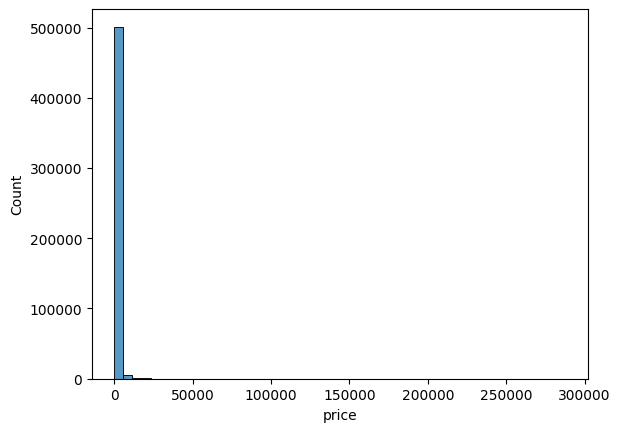

* The huge spike near ₹0–₹2,000 shows that most products are low to mid-priced.

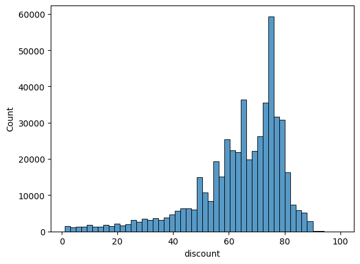

* Flipkart’s pricing strategy favors high visible discounts; pricing appears heavily “inflated MRP + large discount”, common in e-commerce.

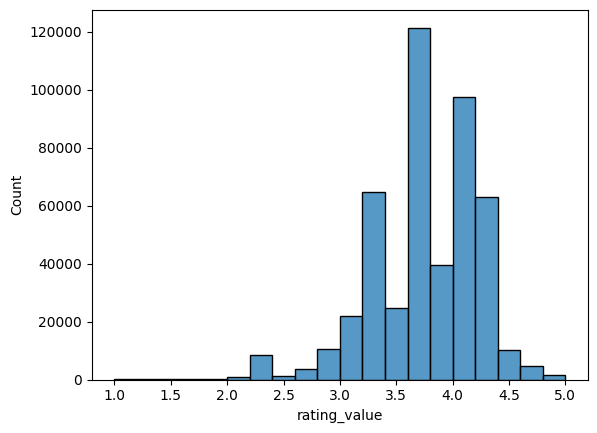

* Ratings vary only slightly across products, meaning rating_value is not a strong differentiator and may have limited predictive power for discount.

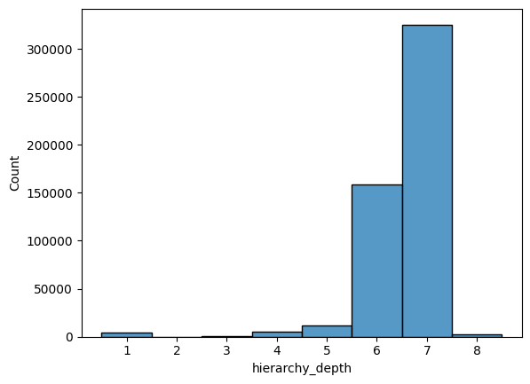

* Majority of products have deep category hierarchies
* Depth 8 is extremely rare

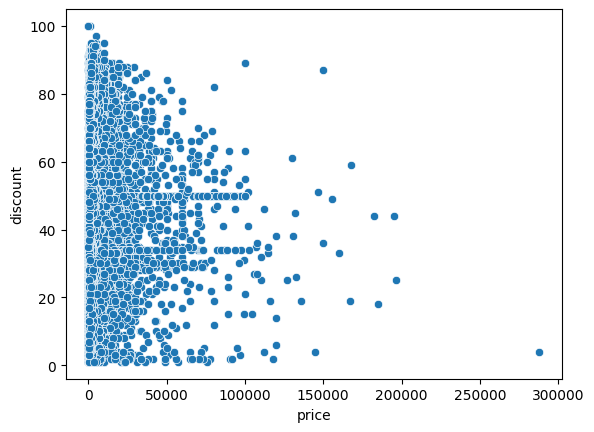

* Most products fall under ₹2,000–₹10,000, causing:
    * dense cloud on the left
    * sparse distribution on the right
* Cheapest items get 0% to 100% discounts
    * Wide variation regardless of price
* Discount values cluster around 40%, 50%, 60%, 70%
* Products priced ₹100,000+ are:
    * rare
    * inconsistently discounted
    * spread from 0% to 90%

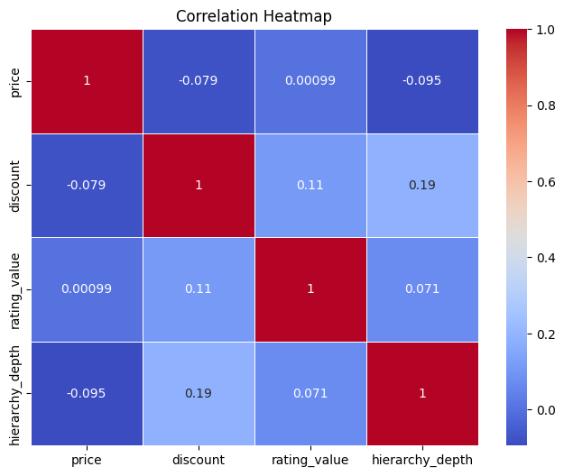

* price and discount: Higher-priced products do NOT consistently get higher or lower discounts.
* rating_value and discount: Products with higher discounts tend to have slightly higher ratings.
* hierarchy_depth and discount: Products with deeper categories (depth 6–7) tend to get slightly higher discounts.

### Categorical Feature Analysis

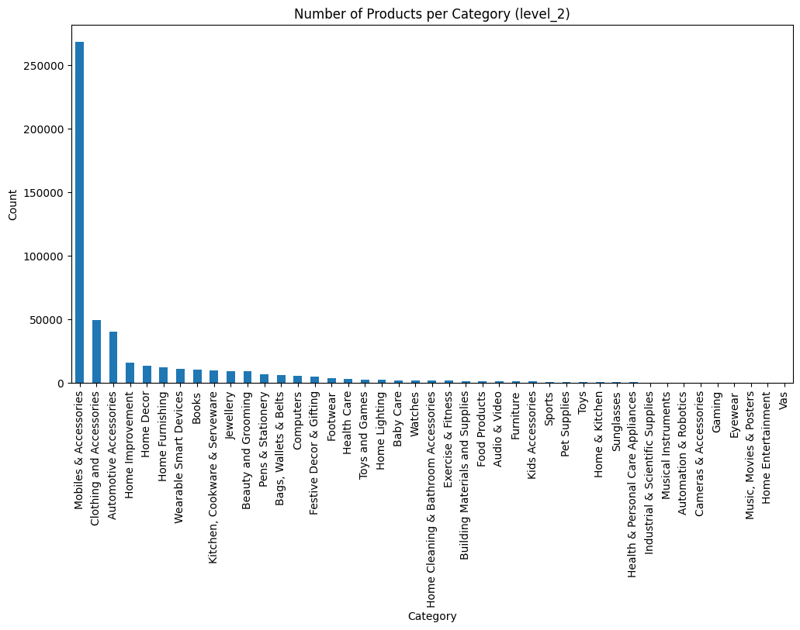

* Mobiles & Accessories massively dominate (over 250,000 products), while most other categories have fewer than 10,000.
* This imbalance will hurt analysis, modeling, and clustering unless handled.

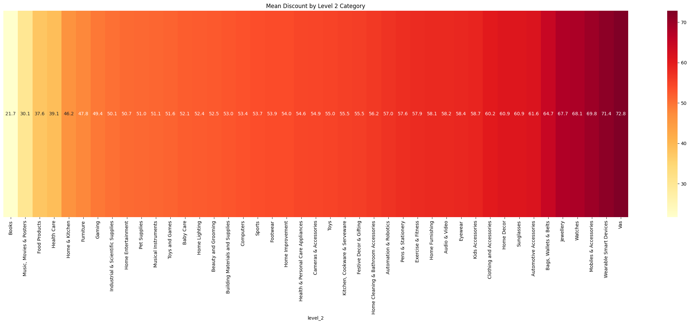

* Books and media categories have the lowest discounts (~22–30%), indicating fixed-price or low-margin products.
* Most household and utility categories lie in the mid-range (50–57% discounts), showing standard competitive pricing.
* Fashion and lifestyle categories show higher discounts (~58–65%), reflecting strong promotional strategies.
* Jewellery, watches, and accessories exceed 67% average discounts, marking them as highly discount-driven markets.
* Mobile accessories and wearable devices top the list with ~70–73% discounts, proving aggressive price-cutting in electronics accessories.

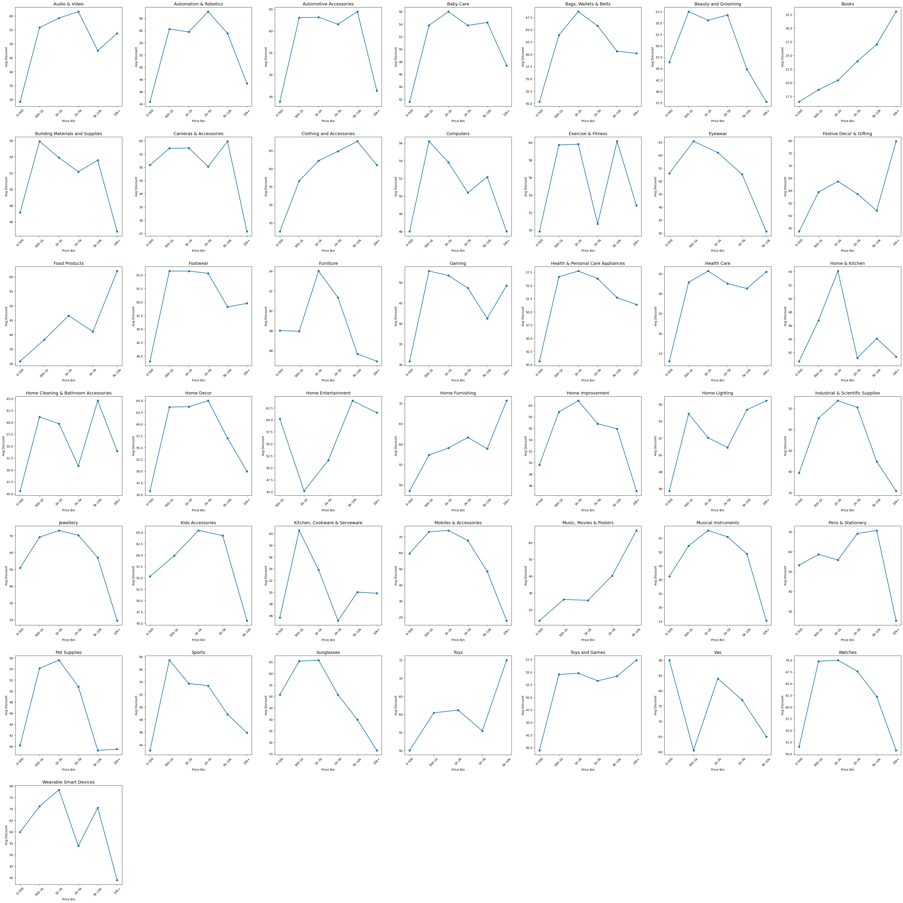

* Most categories show highest discounts in mid-range price bins rather than very cheap or very expensive items.
* Low-priced products consistently have the smallest discounts due to tight margins.
* High-priced items see reduced discounts, suggesting premium positioning or margin protection.
* Fashion and lifestyle categories display strong discount volatility, indicating seasonal and promotional cycles.
* Essential goods like books, groceries, and office supplies maintain stable, lower-variance discount patterns.

### Textual Analysis

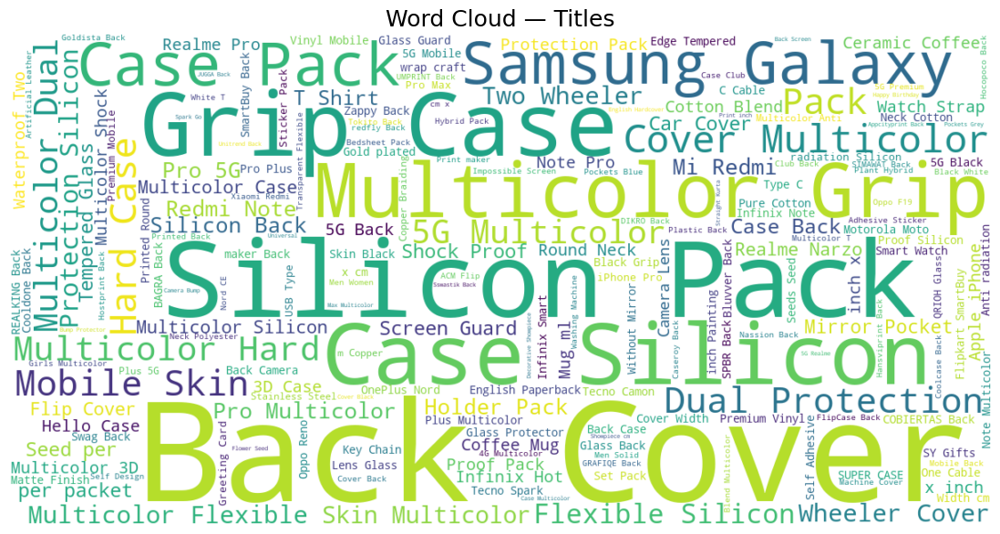


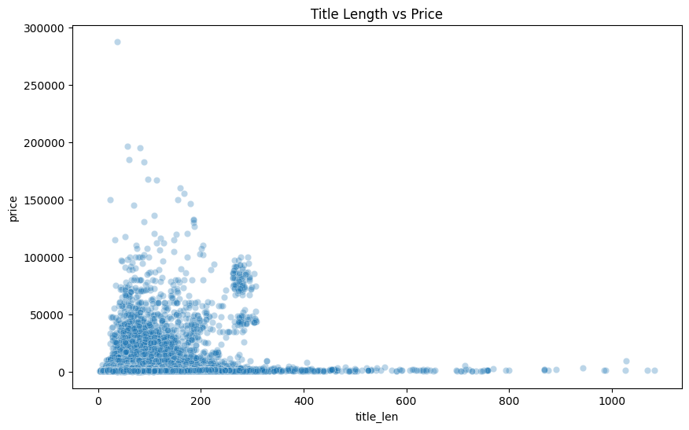

* Title length has no noticeable correlation with price — the scatter is widely dispersed.
* Most products use short titles (below ~150 characters), forming a dense cluster.
* Very long titles (300–1000+ characters) mostly correspond to low-priced items, indicating keyword stuffing.
* High-priced items only appear with short to medium-length titles, never with extremely long ones.
* The price distribution is heavily skewed toward low and mid-range products, regardless of title length.

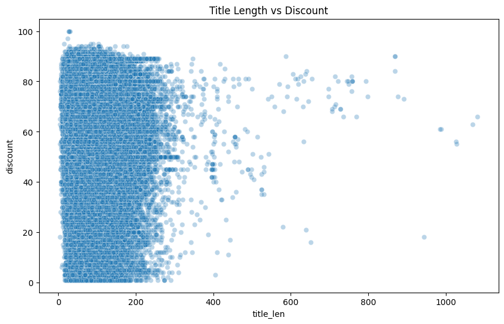

* No clear correlation exists between title length and discount — discounts appear across all title lengths.
* Most products with very short to medium titles (0–200 chars) receive the full range of discounts, from 0% to 100%.
* Extremely long titles (400–1000+ chars) tend to cluster around medium-to-high discounts, suggesting many are promotional or keyword-stuffed listings.
* High-discount items are not associated with any specific title length, indicating discounting depends on category/merchant strategy rather than title structure.
* The plot is dominated by shorter titles, reflecting typical e-commerce writing patterns, with longer titles being rare outliers.

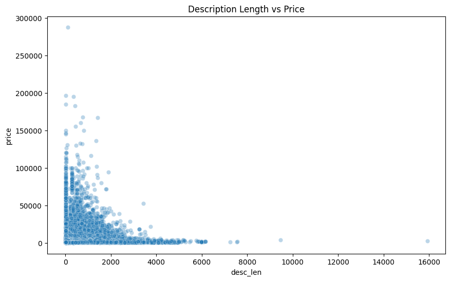

* Most products have short descriptions (under ~1500 characters), forming a dense cluster on the left side.
* Higher-priced items appear mostly in the short-to-medium description range, suggesting premium products don’t rely on very long text.
* Extremely long descriptions (5000–16000+ chars) almost always belong to low-priced items, likely due to keyword stuffing or bulk-listed items.
* There is no strong positive correlation between description length and price, meaning long text doesn’t indicate a higher value item.
* Price distribution is heavily skewed toward low and mid-range items regardless of description length, similar to your title-length result.

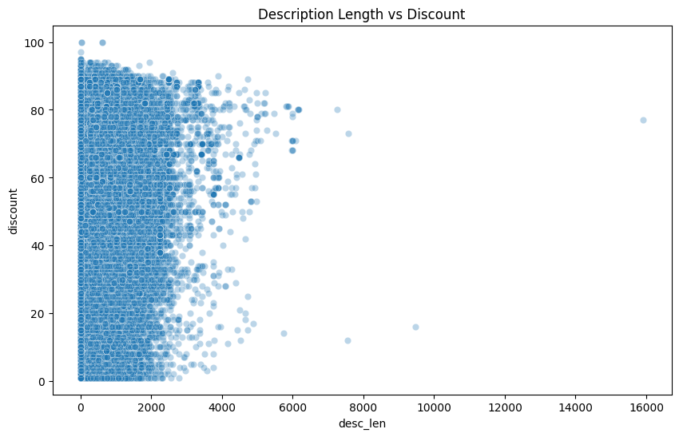

* Discounts are spread across all description lengths, showing no strong correlation between how long a description is and the discount offered.
* Most discounts occur in products with short to medium descriptions (0–2000 characters), where the plot is densely populated.
* Very long descriptions (4000–16000+ characters) tend to have medium-to-high discounts, suggesting these listings may be promotional or keyword-heavy.
* Short descriptions also include the full range of discounts (0–100%), indicating merchants’ discounting strategies are independent of description detail.
* The heavy vertical clustering near lower character counts shows that most sellers use brief descriptions, regardless of the discount level.

## Machine Learning Models and Results

| **Model**                                | **RMSE**    | **R² Score** |
| ---------------------------------------- | ----------- | ------------ |
| Linear Regression                        | 13.7646     | 0.4915       |
| Ridge Regression                         | 13.7380     | 0.4935       |
| Lasso Regression                         | 14.0793     | 0.4680       |
| Elastic Net                              | 14.6368     | 0.4251       |
| **Ridge (After RandomSearchCV)**         | **13.3408** | **0.5224**   |
| Decision Tree                            | 14.4648     | 0.4385       |
| Random Forest                            | 11.8994     | 0.6200       |
| **Random Forest (After RandomSearchCV)** | **10.7382** | **0.6905**   |
| LightGBM                                 | 12.5290     | 0.5787       |
| **LightGBM (After RandomSearchCV)**      | **11.3525** | **0.6541**   |
| XGBoost                                  | 12.4114     | 0.5866       |
